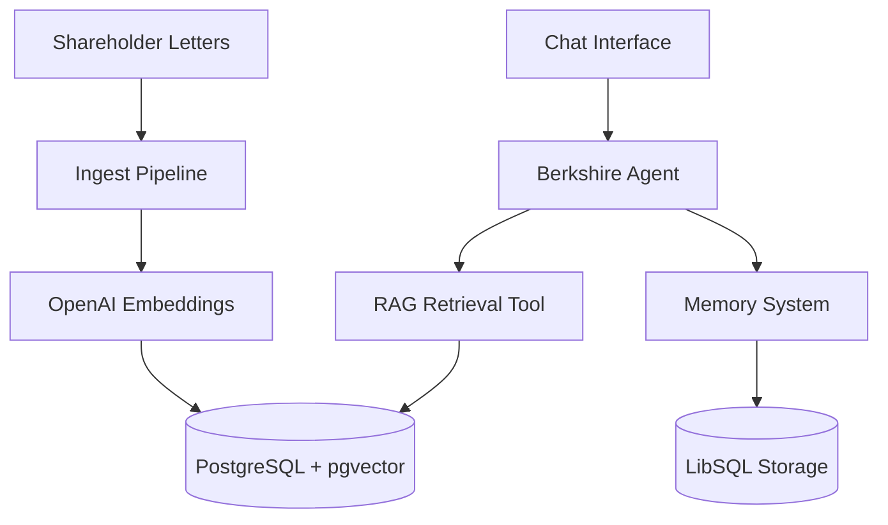

# Berkshire Hathaway Intelligence

An AI-powered RAG (Retrieval-Augmented Generation) application that intelligently answers questions about Warren Buffett's investment philosophy using Berkshire Hathaway shareholder letters from 1977-2024.

**🌐 Live Demo:** [https://berkshire-hathaway-intelligence.onrender.com](https://berkshire-hathaway-intelligence.onrender.com)

## 🚀 Features

- **RAG Pipeline**: Semantic search across shareholder letters (1977-2024)
- **Streaming Responses**: Real-time AI responses with character-by-character streaming
- **Source Attribution**: Automatic citation of letter years used in responses
- **Conversation Memory**: Persistent chat history with context preservation
- **AI-Generated Titles**: Smart conversation titles generated by AI
- **Modern UI**: Gemini-inspired interface with left sidebar, temporal grouping, and search

## 🏗️ System Architecture



### Data Flow

1. **User Query** → Sent to Mastra Agent via streaming API
2. **RAG Retrieval** → Agent uses RAG tool to search vector database
3. **Context Assembly** → Relevant document chunks retrieved with metadata
4. **AI Generation** → GPT-4o generates response with citations
5. **Streaming Response** → Real-time character-by-character display
6. **Memory Persistence** → Conversation saved for continuity

## 📦 Deployment (Render)

The application is deployed on **Render** using a multi-service architecture:

### 1. Database Setup
- **Service**: Render Managed PostgreSQL
- **Extension**: `pgvector` enabled via `CREATE EXTENSION IF NOT EXISTS vector;`
- **Location**: Singapore (AWS)

### 2. Web Service Configuration
- **Runtime**: Node.js 22+
- **Build Command**: `npm install --include=dev && npm run build`
- **Start Command**: `npm run start:all` (Starts both Mastra backend and Next.js frontend)
- **Environment Variables**:
  - `DATABASE_URL`: Connection string to PostgreSQL
  - `OPENAI_API_KEY`: API key for GPT-4o and Text Embeddings
  - `NODE_ENV`: `production`

### 3. Data Ingestion
- Documents were ingested into the production database using a local script pointed at the Render database URL:
  ```bash
  DATABASE_URL=postgres://... npm run ingest
  ```

## 🛠️ Local Installation

1. **Clone the repository**
   ```bash
   git clone https://github.com/delisha02/berkshire-hathaway-intelligence.git
   cd berkshire-hathaway-intelligence
   ```

2. **Install dependencies**
   ```bash
   npm install
   ```

3. **Configure environment**
   ```bash
   # Create .env file and add your OpenAI API key and DATABASE_URL
   OPENAI_API_KEY=your-api-key-here
   DATABASE_URL=postgres://localhost:5432/mastra
   ```

4. **Ingest shareholder letters**
   ```bash
   npm run ingest
   ```

## 🚀 Running Locally

Start both the Mastra backend and Next.js frontend:

```bash
npm run dev:all
```

- **Frontend**: [http://localhost:3000](http://localhost:3000)
- **Mastra Studio**: [http://localhost:4111](http://localhost:4111)

## 📁 Project Structure

```
berkshire-hathaway-intelligence/
├── src/
│   ├── app/                    # Next.js frontend
│   │   ├── page.tsx            # Main chat interface
│   ├── mastra/
│   │   ├── agents/             # AI agents
│   │   ├── tools/              # RAG retrieval tool
│   │   ├── index.ts            # Mastra configuration
│   │   ├── storage.ts          # Persistent storage
│   │   └── vector-store.ts     # Vector database (pgvector)
│   └── scripts/
│       └── ingest-documents.ts # Document ingestion script
```

## 🧪 Testing

### Quick Test Queries:
1. "What is Warren Buffett's investment philosophy?"
2. "What companies did Berkshire acquire in 2023?"
3. "What are Buffett's views on diversification?"
4. "How has Berkshire's strategy evolved over the past 5 years?"

## 🔧 Tech Stack

- **Framework**: [Mastra](https://mastra.ai/) for AI agent orchestration
- **Frontend**: Next.js with TypeScript & Framer Motion
- **Styling**: TailwindCSS
- **AI Model**: OpenAI GPT-4o
- **Vector Store**: PostgreSQL with **pgvector**
- **Memory**: LibSQL (local) / SQLite

## 📄 License

This project is for educational purposes as part of a RAG assignment.

## 🤝 Contributing

Feel free to submit issues and pull requests!
