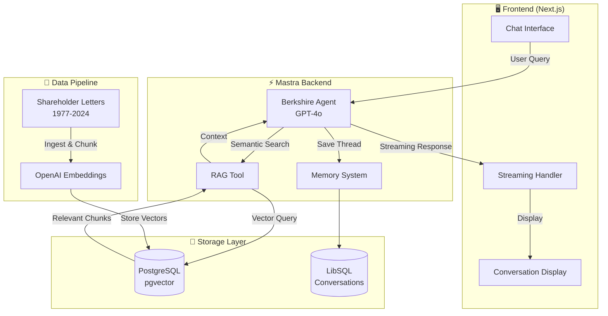

# Berkshire Hathaway Intelligence

An AI-powered RAG (Retrieval-Augmented Generation) application that intelligently answers questions about Warren Buffett's investment philosophy using Berkshire Hathaway shareholder letters from 1977-2024.

## 🚀 Features

- **RAG Pipeline**: Semantic search across 6 years of shareholder letters (2019-2024)
- **Streaming Responses**: Real-time AI responses with character-by-character streaming
- **Source Attribution**: Automatic citation of letter years used in responses
- **Conversation Memory**: Persistent chat history with context preservation
- **AI-Generated Titles**: Smart conversation titles generated by AI
- **Modern UI**: Gemini-inspired interface with left sidebar, temporal grouping, and search

## 🏗️ System Architecture



### Data Flow

1. **User Query** → Sent to Mastra Agent via streaming API
2. **RAG Retrieval** → Agent uses RAG tool to search vector database
3. **Context Assembly** → Relevant document chunks retrieved with metadata
4. **AI Generation** → GPT-4o generates response with citations
5. **Streaming Response** → Real-time character-by-character display
6. **Memory Persistence** → Conversation saved for continuity

## 📋 Prerequisites

- Node.js 18+
- OpenAI API Key
- npm or yarn

## 🛠️ Installation

1. **Clone the repository**
   ```bash
   git clone https://github.com/delisha02/berkshire-hathaway-intelligence.git
   cd berkshire-hathaway-intelligence
   ```

2. **Install dependencies**
   ```bash
   npm install
   ```

3. **Configure environment**
   ```bash
   # Create .env file
   cp .env.example .env
   
   # Add your OpenAI API key
   OPENAI_API_KEY=your-api-key-here
   ```

4. **Ingest shareholder letters**
   ```bash
   npx tsx src/scripts/ingest-documents.ts
   ```

## 🚀 Running the Application

Start both the Mastra backend and Next.js frontend:

```bash
npm run dev:all
```

Access the application:
- **Frontend**: [http://localhost:3000](http://localhost:3000)
- **Mastra Studio**: [http://localhost:4111](http://localhost:4111)
- **API**: [http://localhost:4111/api](http://localhost:4111/api)

## 📁 Project Structure

```
berkshire-hathaway-intelligence/
├── src/
│   ├── app/                    # Next.js frontend
│   │   ├── page.tsx            # Main chat interface
│   │   ├── layout.tsx          # App layout
│   │   └── globals.css         # Global styles
│   ├── components/
│   │   └── MastraProvider.tsx  # Mastra client provider
│   ├── mastra/
│   │   ├── agents/             # AI agents
│   │   ├── tools/              # RAG retrieval tool
│   │   ├── index.ts            # Mastra configuration
│   │   ├── storage.ts          # Persistent storage
│   │   └── vector-store.ts     # Vector database
│   └── scripts/
│       └── ingest-documents.ts # Document ingestion script
├── Berkshire_Hathaway_Shareholder_Letters/  # Source documents
└── TESTING_DEPLOYMENT.md       # Testing & deployment guide
```

## 🧪 Testing

See [TESTING_DEPLOYMENT.md](./TESTING_DEPLOYMENT.md) for comprehensive testing instructions.

### Quick Test Queries:

1. "What is Warren Buffett's investment philosophy?"
2. "What companies did Berkshire acquire in 2023?"
3. "What are Buffett's views on diversification?"
4. "How has Berkshire's strategy evolved over the past 5 years?"

## 🔧 Tech Stack

- **Framework**: [Mastra](https://mastra.ai/) for AI agent orchestration
- **Frontend**: Next.js 16 with TypeScript
- **Styling**: TailwindCSS
- **AI Model**: OpenAI GPT-4o
- **Vector Store**: LibSQL with Mastra's built-in embeddings
- **Animations**: Framer Motion

## 📦 Deployment

### Mastra Cloud (Recommended)
```bash
mastra deploy
```

### Docker
```bash
docker build -t berkshire-intelligence .
docker run -p 3000:3000 -p 4111:4111 berkshire-intelligence
```

## 📄 License

This project is for educational purposes as part of a RAG assignment.

## 🤝 Contributing

Feel free to submit issues and pull requests!
