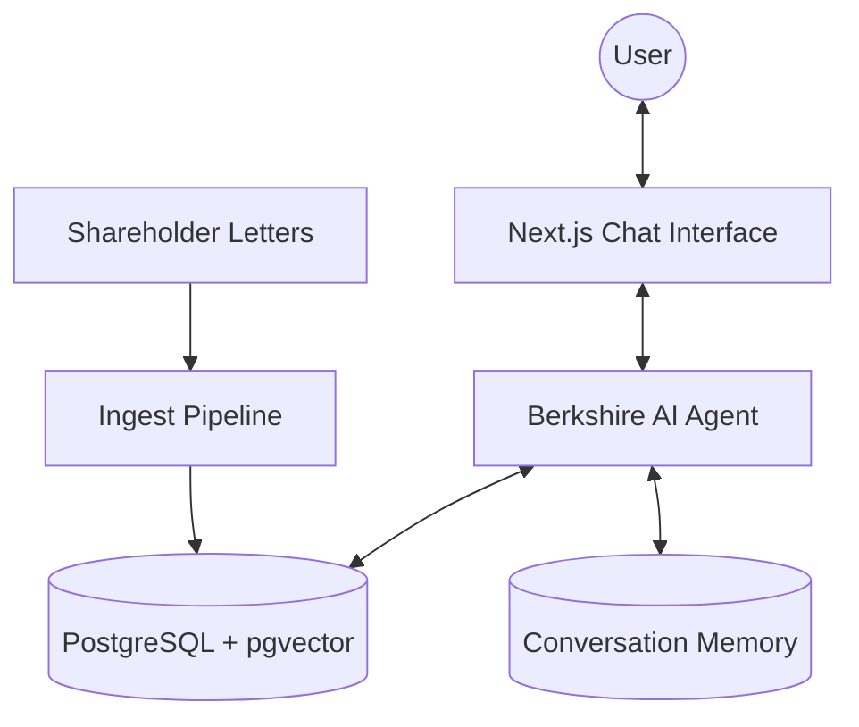

# Berkshire Hathaway Intelligence

An AI-powered RAG (Retrieval-Augmented Generation) application that intelligently answers questions about Warren Buffett's investment philosophy using Berkshire Hathaway shareholder letters from 1977-2024.

**🌐 Live Demo:** [https://berkshire-hathaway-intelligence.onrender.com](https://berkshire-hathaway-intelligence.onrender.com)

## 🚀 Features

- **RAG Pipeline**: Semantic search across shareholder letters (1977-2024)
- **Streaming Responses**: Real-time AI responses with character-by-character streaming
- **Source Attribution**: Automatic citation of letter years used in responses
- **Conversation Memory**: Persistent chat history with context preservation
- **AI-Generated Titles**: Smart conversation titles generated by AI
- **Modern UI**: Gemini-inspired interface with left sidebar, temporal grouping, and search

## 🏗️ System Architecture



### Data Flow

1. **User Query** → Sent to Mastra Agent via streaming API
2. **RAG Retrieval** → Agent uses RAG tool to search vector database
3. **Context Assembly** → Relevant document chunks retrieved with metadata
4. **AI Generation** → GPT-4o generates response with citations
5. **Streaming Response** → Real-time character-by-character display
6. **Memory Persistence** → Conversation saved for continuity

## 📦 Deployment (Render)

The application is deployed on **Render** using a multi-service architecture defined in `render.yaml`:

### 1. Database Setup (Managed PostgreSQL)
- **Service**: Render Managed PostgreSQL
- **Plan**: Free (Sandbox) or Starter
- **Extension**: `pgvector` enabled via command: `CREATE EXTENSION IF NOT EXISTS vector;`

### 2. Web Service Configuration
- **Runtime**: Node.js
- **Build Command**: `npm install --include=dev && npm run build`
- **Start Command**: `npm run start:all` (Starts both Mastra backend and Next.js frontend)
- **Environment Variables**:
  - `DATABASE_URL`: Internal connection string to PostgreSQL
  - `OPENAI_API_KEY`: API key for GPT-4o and Text Embeddings
  - `NODE_ENV`: `production`

### 3. Production Data Ingestion (CRITICAL)
Mastra RAG requires the vector database to be populated. After deploying to Render:

1. Go to your Render Dashboard → Select the Web Service.
2. Click on **Shell** (SSH).
3. Run the ingestion script directly on the production server:
   ```bash
   npm run ingest
   ```
4. This process reads the PDF files and populates your production `berkshire-pgvector` database.

For more details on Mastra deployment, refer to the [Mastra Documentation](https://mastra.ai/docs).

## 🛠️ Local Installation

1. **Clone the repository**
   ```bash
   git clone https://github.com/delisha02/berkshire-hathaway-intelligence.git
   cd berkshire-hathaway-intelligence
   ```

2. **Install dependencies**
   ```bash
   npm install
   ```

3. **Configure environment**
   ```bash
   # Create .env file and add your OpenAI API key and DATABASE_URL
   OPENAI_API_KEY=your-api-key-here
   DATABASE_URL=postgres://localhost:5432/mastra
   ```

4. **Ingest shareholder letters**
   ```bash
   npm run ingest
   ```

## 🚀 Running Locally

Start both the Mastra backend and Next.js frontend:

```bash
npm run dev:all
```

- **Frontend**: [http://localhost:3000](http://localhost:3000)
- **Mastra Studio**: [http://localhost:4111](http://localhost:4111)

## 📁 Project Structure & Implementation Map

| Component | Implementation File |
|-----------|---------------------|
| **Agent** | `src/mastra/agents/berkshire-agent.ts` |
| **Tools** | `src/mastra/tools/berkshire-tool.ts` |
| **Memory** | `src/mastra/storage.ts` (LibSQL) |
| **Vector Store** | `src/mastra/vector-store.ts` (PgVector) |
| **Ingestion** | `src/scripts/ingest-documents.ts` |
| **Frontend** | `src/app/page.tsx` |
| **Mastra Config** | `src/mastra/index.ts` |

```
berkshire-hathaway-intelligence/
├── src/
│   ├── app/                    # Next.js frontend
│   │   ├── page.tsx            # Main chat interface (Mastra Client)
│   ├── mastra/
│   │   ├── agents/             # Agent definitions & system prompts
│   │   ├── tools/              # RAG retrieval tools
│   │   ├── index.ts            # Mastra instance configuration
│   │   ├── storage.ts          # Memory storage configuration
│   │   └── vector-store.ts     # Vector database connection
│   └── scripts/
│       └── ingest-documents.ts # PDF ETL pipeline (MDocument)
```

## 🧪 Testing

### Quick Test Queries:
1. "What is Warren Buffett's investment philosophy?"
2. "What companies did Berkshire acquire in 2023?"
3. "What are Buffett's views on diversification?"
4. "How has Berkshire's strategy evolved over the past 5 years?"

## 🔧 Tech Stack

- **Framework**: [Mastra](https://mastra.ai/) for AI agent orchestration
- **Frontend**: Next.js with TypeScript & Framer Motion
- **Styling**: TailwindCSS
- **AI Model**: OpenAI GPT-4o
- **Vector Store**: PostgreSQL with **pgvector**
- **Memory**: LibSQL (local) / SQLite

## 📄 License

This project is for educational purposes as part of a RAG assignment.

## 🤝 Contributing

Feel free to submit issues and pull requests!
